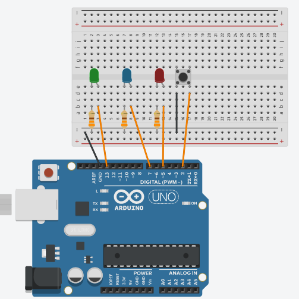

# Pomodoro Timer
During lockdown, staying productive has been one of my biggest challenges. Despite every effort, the struggle of not being distracted by phone and scrolling social media feed endlessly while I'm supposed to be studying is real. That's why, I wanted to come up with a timer that would help me follow Pomodoro technique effectively.

## What is Pomodoro technique?
The Pomodoro technique is a time management methodology that combines task-driven planning with periods of focused time broken up with short rest periods.

The Pomodoro Technique was developed in the late 1980s by then university student Francesco Cirillo. Cirillo was struggling to focus on his studies and complete assignments. Feeling overwhelmed, he asked himself to commit to just 10 minutes of focused study time. Encouraged by the challenge, he found a tomato (pomodoro in Italian) shaped kitchen timer, and the Pomodoro technique was born.
 
It involves breaking up overall time into intervals of 25 minutes and 5 minutes. Every ‘pomodoro’ completed, i.e 25 minutes, has a 5-minute break as a reward. This way, Podomoro technique helps one to stay motivated and focused in the work time period as there is a pre-decided break. This method has been scientifically proven to be helpful for different kinds of activities.

## Working
This a completely an electronic build with Arduino UNO as the primary component. It will have 3 lights : each for work mode, break mode and warning. The work light will stay on for 25 minutes, and the warning light will also be on for the last two minutes of that interval. After 25 minutes, the work and warning lights will turn off, and the break light will turn on for 5 minutes (the warning light will again be on for the last two minutes). Also included will be a button that will delay the change of the lights for two minutes to give you a little extra work time or break time.

## Components required
Arduino UNO <br />
Breadboard <br />
USB cable (USB-A to Mini-USB Cable) <br />
Jumper wires <br />
3 x 330 Ohm resistors <br />
3 x LED (yellow, green, blue) <br />
1 pushbutton <br />

## The build!
Each LEDs(blue, yellow ,green) and a pushbutton are put into different columns on the breadboard. <br />
Wires from pins 5, 7, and 13 are connected to anode of the blue, yellow and green LEDs respectively. Now, 330 Ohm resistor is connected, with one end to the cathode of each LED and the other to the negative rail on the side of the breadboard. <br />
 <br />
Run a wire from the blue rail on the breadboard to one of the legs on the button, and another wire from the other leg to pin 2 on the Arduino. Then ground the blue rail into the GND pin on the Arduino.

## Pseudocode
(Pseudocode of "phase" logic) <br />
IF phase==0 THEN <br />
Check IF button has been pressed==1 <br />
IF yes, change the interval to 1620000 then continue on <br />
IF no, continue on <br />
IF the current minus the previous is greater than the interval, then set previous to current <br />
Then IF the green LED state is HIGH, then change the LED state of green to HIGH and blue to LOW. IF LOW, then change the LED state of green to LOW <br />
Next, continue onto “digitalwrite” the green and blue LEDs to their “ledState”, set interval to 1500000 , phase to 1 and buttonState to 1 <br />
ELSE <br />
IF button pressed==1 then change interval to 420000. Else, check if the current-previous is greater than interval <br />
If yes then set previous to current then check whether blue LED was HIGH. If it was, then set blue LED to LOW. Otherwise set LED red to HIGH and LED green to LOW <br />
Either way, “digitalwrite” the green and blue LEDs to their “ledState” and set interval to 300000, button state to 1 and phase to 0 <br />
Altogether, IF timeleft is less than 120000 then turn digital write yellow high and turn pressed = 0 <br />
ELSE digital write yellow low then turn pressed = 0 <br />
END <br />

## Flowchart
 <br />
continued... <br />
 <br />

## Code
I used the Online Arduino ide to compile the code. It required me to install some additional drivers however the experience of working with online ide was smoother compared to my past experience of using the desktop application.
```cpp
int green = 13;
int yellow = 7;
int blue = 5;
int ledStateGreen = LOW;
int ledStateBlue = LOW;
long previous = 0;
long interval;
int buttonPin = 2;
int buttonState = 1;
bool pressed = 0;
long pressTime = 0;
int phase = 0;
void setup() {
 pinMode(green, OUTPUT);
 pinMode(yellow, OUTPUT);
 pinMode(blue, OUTPUT);
 pinMode(buttonPin, INPUT_PULLUP);
 digitalWrite(buttonPin, HIGH);
}
void loop() {
 
// update current time and state of button
unsigned long current = millis();
int buttonState = digitalRead(buttonPin);
// measure time since last button press
long progress = current - previous;
// check to see if button has been pressed
// over 2 seconds since last press
// (to prevent multiple presses registering)
if ((pressTime - current) > 2000){
 if(buttonState == 0){
   pressed = 1;
   pressTime = current;
}
 else{
    pressed = 0;}
}
// phase 0 is "work" phase
// if button has been pressed, add 2 minutes to work timer
if (phase == 0){
 if (pressed == 1){
   interval = 1620000;}
 
 // if interval is over, record current
 // time for measuring next interval 
 if(current - previous > interval) {
   previous = current; 
 // set green and blue LED states
 if (ledStateGreen == LOW){
   ledStateGreen = HIGH;
   ledStateBlue = LOW;}
 else {
   ledStateGreen = LOW;}
 // apply LED states to LEDs
 // reset interval and switch to "break" phase
 digitalWrite(green, ledStateGreen);
 digitalWrite(blue, ledStateBlue);
 interval = 1500000;
 buttonState = 1;
 phase = 1;
 }
}
else {
 
 // if button has been pressed, add 2 minutes to break timer
 if (pressed == 1){
 interval = 420000;}
 
   // if interval is over, record current
   // time for measuring next interval 
   if(current - previous > interval) {
     previous = current; 
   // set blue and green LED states
   if (ledStateBlue == HIGH){;
     ledStateBlue = LOW; }
   else {
     ledStateBlue = HIGH;
     ledStateGreen = LOW;}
 // apply LED states to LEDs
 // reset interval and set to "work" phase
 digitalWrite(green, ledStateGreen);
 digitalWrite(blue, ledStateBlue);
 interval = 300000;
 buttonState = 1;
 phase = 0;
 }
}
// calculate time left in interval
unsigned long timeLeft = (interval - progress);
// if there are less than two minutes left, light up yellow LED
if (timeLeft < 120000) {
  digitalWrite(yellow, HIGH); }
else {
  digitalWrite(yellow, LOW); }
// reset pressed variable
 pressed = 0;
}

```
## Inference
While testing, I set the interval for a short time so that it's easy to verify. I had the intervals set to 10 seconds for green(Work), 2 seconds for yellow(Warning), and 4 second for blue(Break). Green LED glows for 10 seconds and 2 seconds before it goes off, yellow starts to glow as warning and then it goes off along with green LED. Now, blue LED starts to glow and before it goes off, yellow LED glows again as warning and so on. Pressing pushbutton increased the work and/or break time by a second. <br />


## Further improvements
After coming across mqtt protocol in this course, I had thought about integrating the power of IOT with my build. One of the ways this can be made possible is by making the existing build interact with a simple webpage to keep count of the pomodoro's completed in a longer span of time. Also, integrating calander with current model can level it up. I will surely work on the these ideas in future. Thank you! 

